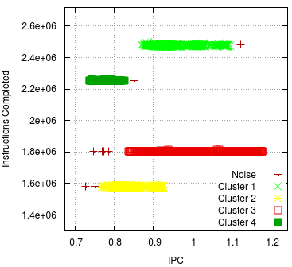

# Boost Clustering Kernel
Set of boosted clustering kernels with competitive performance and less computation time
to the state-of-the-art methods, which consists of a density-based algorithms enhanced
by the boosting principle.



## Dependencies

The core features of the BoostClustering toolkit including density-based clustering analysis of 
Paraver traces requires the following libraries installed on your system:

* [libxml2 ("--with-libxml2" configure option)](http://www.xmlsoft.org/)

  - Download the [libxml2 library](http://xmlsoft.org/sources/libxml2-2.9.10.tar.gz).

    ```bash
      tar xvmf <SOURCES> --strip=1 -C <SRCDIR>
      rm <SOURCES>
      cd <SRCDIR>
    ```
    
    ```bash
      ./configure --prefix=/usr/local/libxml/ --without-python --without-zlib
    ```
    ```bash
      sudo make install
    ```

* [Boost libraries ("--with-boost" configure option). Version >= 1.70](http://www.boost.org/ )

  - Download the [Boost library](http://downloads.sourceforge.net/project/boost/boost/1.73.0/boost_1_73_0.tar.bz2).
    
    ```bash
      tar xvmf <SOURCES> --strip=1 -C <SRCDIR>
      rm <SOURCES>
      cd <SRCDIR>
    ```

    ```bash
    ./bootstrap.sh --prefix=/usr/local/boost/ --with-toolset=`tools/build/src/engine/build.sh --guess-toolset` --with-libraries=serialization,system,thread,date_time,chrono,atomic,program_options,timer,filesystem
    ```
    ```bash
    sudo ./b2 toolset=gcc install
    ```

### Optional

#### Enabling CAPEK algorithm

* [Muster clustering library ("--with-muster" configure option)](http://tgamblin.github.com/muster/main.html)
* [An MPI implementation ("--with-mpi" configure option)](http://www.mcs.anl.gov/research/projects/mpich2/)

#### Enabling MRNet-based parallel DBSCAN
* [Synapse ("--with-synapse" configure option)](http://www.bsc.es/performance-tools/downloads)
* [Computational Geometry Algorithms Library (CGAL) ("--with-cgal" configure option)](http://www.cgal.org/)
* [GNU MPFR (required by CGAL) ("--with-mpfr" cnfigure option)](http://www.mpfr.org/)
* [The GNU Multiple Precision Arithmetic Library, which required by CGAL("--with-gmp" configure option)](http://www.gmplib.org)

## Install BoostClustering
```bash
./configure --prefix=/usr/local/BoostClustering/ --with-boost=/usr/local/boost/ --with-xml-prefix=/usr/local/libxml/ CFLAGS="-O3 -funroll-loops" CXXFLAGS="-O3 -funroll-loops -std=gnu++14"
```

```bash
sudo make -j$(getconf _NPROCESSORS_ONLN)
```
```bash
sudo make install
```

## Example
```bash
cd /usr/local/BoostClustering/share/example/
```
```bash
../../bin/BurstClustering -d cluster.xml -i gromacs_64p.chop1.prv -o ~/Desktop/gromacs_64p.chop1.clustered.prv
```


