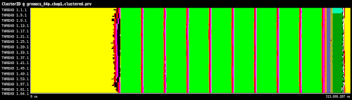

# GROMACS Application Clustering 
## GROMACS
GROMACS is a versatile package to perform molecular dynamics, i.e. simulate the Newtonian equations of motion 
for systems with hundreds to millions of particles and is a community-driven project. Contributions are welcome
in many forms, including improvements to documentation, patches to fix bugs, advice on the forums, bug reports
that let us reproduce the issue, and new functionality. See Development page and Report an issue.

It is primarily designed for biochemical molecules like proteins, lipids and nucleic acids that have a lot of
complicated bonded interactions, but since GROMACS is extremely fast at calculating the nonbonded interactions 
(that usually dominate simulations) many groups are also using it for research on non-biological systems, 
e.g. polymers and fluid dynamics.

## Clustering Analysis

```bash
cd /usr/local/BoostClustering/share/example/
```
```bash
../../bin/BurstClustering -d cluster.xml -i gromacs_64p.chop1.prv -o ~/Desktop/gromacs_64p.chop1.clustered.prv
```


